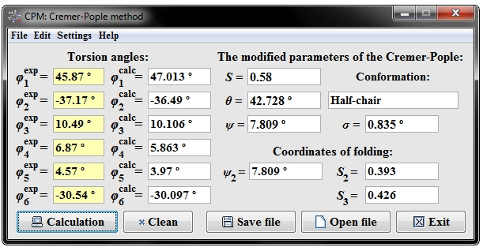

<h1>CPM</h1>
**CPM** (Cremer-Pople method) is a desktop program for conformational analysis of heterocyclic compounds.
This program allows to determine the minimum number of parameters conformation cycle distortion, quantitatively describe cyclic fragments, which are in different molecules, using the geometry of the molecule. CPM program to calculate the modified Cremer-Pople parameters uses torsion angles of heterocycles.

[ **Yurii Salimov**](https://www.linkedin.com/in/yurii-salimov)
